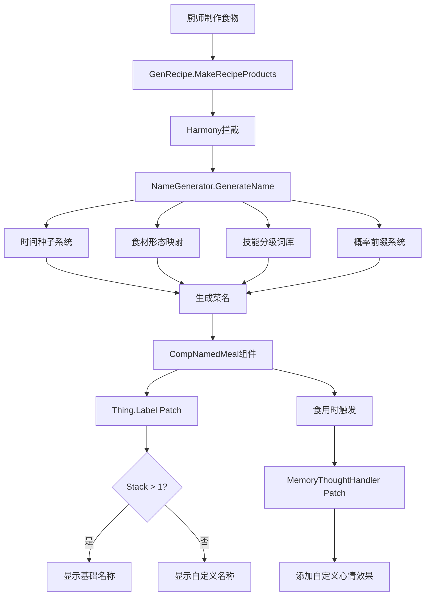
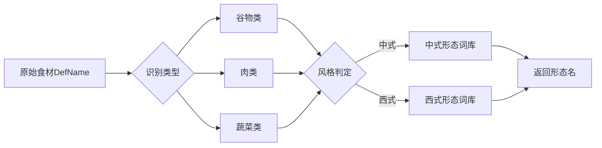

# 厨间百艺 (Culinary Arts 100) - 技术架构文档

## 项目概述

**模组名称**: 厨间百艺 (Culinary Arts 100)  
**目标平台**: RimWorld 1.4+  
**核心技术**: C# + Harmony + XML Defs  
**设计理念**: 程序化文本生成 + 沉浸式动态命名系统

---

## 系统架构总览



---

## 核心组件设计

### 1. CompNamedMeal 组件

**职责**: 为每个食物实例存储自定义数据

```csharp
public class CompNamedMeal : ThingComp
{
    public string customName;        // 自定义菜名
    public int moodOffset;            // 心情加成 (-3 到 +8)
    public int generationSeed;        // 生成时的种子值
    public string cuisineStyle;       // 中式/西式
    
    public override void PostExposeData()
    {
        Scribe_Values.Look(ref customName, "customName");
        Scribe_Values.Look(ref moodOffset, "moodOffset", 0);
        Scribe_Values.Look(ref generationSeed, "generationSeed");
        Scribe_Values.Look(ref cuisineStyle, "cuisineStyle");
    }
}
```

**CompProperties 定义**:
```xml
<ThingDef ParentName="MealBase">
    <comps>
        <li Class="CulinaryArts.CompProperties_NamedMeal"/>
    </comps>
</ThingDef>
```

---

### 2. 时间种子系统

**目标**: 6小时内同厨师同食材产出一致菜名

```csharp
public static class TimeSeedGenerator
{
    private const int TICKS_PER_WINDOW = 15000; // 6小时
    
    public static int GenerateSeed(Pawn chef, List<Thing> ingredients)
    {
        int pawnHash = chef.thingIDNumber * 397;
        int ingredientHash = GetIngredientHash(ingredients);
        int timeWindow = Find.TickManager.TicksGame / TICKS_PER_WINDOW;
        
        return pawnHash ^ ingredientHash ^ timeWindow;
    }
    
    private static int GetIngredientHash(List<Thing> ingredients)
    {
        int hash = 0;
        foreach (var ingredient in ingredients.OrderBy(t => t.def.defName))
        {
            hash ^= ingredient.def.GetHashCode();
        }
        return hash;
    }
}
```

**关键设计点**:
- 使用整除确保时间窗口的离散性
- 食材按defName排序后哈希，确保顺序无关
- 异或操作保证可逆性和均匀分布

---

### 3. 食材形态映射系统



**实现示例**:
```csharp
public static class IngredientMorpher
{
    private static Dictionary<string, IngredientForms> formDatabase = new()
    {
        ["Rice"] = new IngredientForms
        {
            Chinese = new[] { "饭", "粥", "糕", "粉", "肠粉" },
            Western = new[] { "Risotto", "Paella", "Pudding" }
        },
        ["Meat"] = new IngredientForms
        {
            Chinese = new[] { "肉片", "肉丝", "肉排", "蹄髈" },
            Western = new[] { "Steak", "Fillet", "Bits", "Roast" }
        }
        // ... 更多映射
    };
    
    public static string GetForm(ThingDef ingredient, CuisineStyle style, Random rand)
    {
        if (formDatabase.TryGetValue(ingredient.defName, out var forms))
        {
            var pool = style == CuisineStyle.Chinese ? forms.Chinese : forms.Western;
            return pool[rand.Next(pool.Length)];
        }
        return ingredient.label; // 回退到原始名称
    }
}
```

---

### 4. 技能分级词库系统

**层级设计**:

| 等级区间 | Tier名称 | 词汇数量 | 特性 |
|---------|---------|---------|------|
| 0-5 | 生存本能 | 5个 | 粗糙、基础 |
| 6-12 | 烟火家常 | 15个 | 常见技法 |
| 13-17 | 珍馐美馔 | 25个 | 复杂工艺 |
| 18-20 | 登峰造极 | 10个 | 艺术、意境 |

**抽取权重算法**:
```csharp
public static class TechniqueSelector
{
    public static string SelectTechnique(int skillLevel, CuisineStyle style, Random rand)
    {
        var availableTiers = GetAvailableTiers(skillLevel);
        var tier = WeightedRandom(availableTiers, skillLevel, rand);
        var pool = TechniqueDatabase[tier][style];
        return pool[rand.Next(pool.Length)];
    }
    
    private static TechniqueLevel WeightedRandom(List<TechniqueLevel> tiers, int skill, Random rand)
    {
        // 高等级技能更倾向于选择高Tier
        // Tier1: 10%, Tier2: 30%, Tier3: 40%, Tier4: 20%
        float[] weights = CalculateWeights(skill, tiers);
        return RandomFromWeights(tiers, weights, rand);
    }
}
```

---

### 5. 概率前缀系统

**前缀效果表**:

| 前缀 | 心情 | 技能0-5 | 技能6-12 | 技能13-17 | 技能18-20 |
|------|------|---------|----------|-----------|-----------|
| 负面 | -3 | 30% | 10% | 0% | 0% |
| 无 | 0 | 65% | 80% | 75% | 50% |
| 正面 | +3 | 5% | 10% | 20% | 30% |
| 传说 | +8 | 0% | 0% | 5% | 20% |

**实现**:
```csharp
public static class PrefixGenerator
{
    public static (string prefix, int mood) GeneratePrefix(int skillLevel, Random rand)
    {
        float roll = rand.NextFloat();
        
        if (skillLevel <= 5)
        {
            if (roll < 0.30f) return GetNegativePrefix(rand), -3;
            if (roll < 0.95f) return "", 0;
            return GetPositivePrefix(rand), 3;
        }
        else if (skillLevel <= 12)
        {
            if (roll < 0.10f) return GetNegativePrefix(rand), -3;
            if (roll < 0.90f) return "", 0;
            return GetPositivePrefix(rand), 3;
        }
        else if (skillLevel <= 17)
        {
            if (roll < 0.75f) return "", 0;
            if (roll < 0.95f) return GetPositivePrefix(rand), 3;
            return GetLegendaryPrefix(rand), 8;
        }
        else // 18-20
        {
            if (roll < 0.50f) return "", 0;
            if (roll < 0.80f) return GetPositivePrefix(rand), 3;
            return GetLegendaryPrefix(rand), 8;
        }
    }
}
```

---

### 6. 菜名生成核心算法

**完整流程**:

```csharp
public static class NameGenerator
{
    public static void GenerateName(Thing meal, Pawn chef, List<Thing> ingredients)
    {
        // 1. 生成种子
        int seed = TimeSeedGenerator.GenerateSeed(chef, ingredients);
        Random rand = new Random(seed);
        
        // 2. 确定风格
        CuisineStyle style = (CuisineStyle)rand.Next(2);
        
        // 3. 获取技能等级
        int skillLevel = chef.skills.GetSkill(SkillDefOf.Cooking).Level;
        
        // 4. 生成前缀
        var (prefix, mood) = PrefixGenerator.GeneratePrefix(skillLevel, rand);
        
        // 5. 选择技法
        string technique = TechniqueSelector.SelectTechnique(skillLevel, style, rand);
        
        // 6. 转换食材形态
        List<string> forms = ingredients
            .Select(ing => IngredientMorpher.GetForm(ing.def, style, rand))
            .Distinct()
            .ToList();
        
        // 7. 组装名称
        string name = AssembleName(prefix, technique, forms, style);
        
        // 8. 写入组件
        var comp = meal.TryGetComp<CompNamedMeal>();
        if (comp != null)
        {
            comp.customName = name;
            comp.moodOffset = mood;
            comp.generationSeed = seed;
            comp.cuisineStyle = style.ToString();
        }
    }
    
    private static string AssembleName(string prefix, string technique, List<string> forms, CuisineStyle style)
    {
        if (style == CuisineStyle.Chinese)
        {
            // 中式: [前缀] + [技法] + [形态1] + [形态2]
            // 例: 绝世的 + 红烧 + 狮子头
            return $"{prefix}{technique}{string.Join("配", forms)}";
        }
        else
        {
            // 西式: [Prefix] + [Technique] + [Form1] with [Form2]
            // 例: Legendary Confit Beef with Potato Purée
            return $"{prefix} {technique} {string.Join(" with ", forms)}";
        }
    }
}
```

---

## Harmony补丁设计

### Patch 1: 食物生成拦截

```csharp
[HarmonyPatch(typeof(GenRecipe), "MakeRecipeProducts")]
public static class Patch_GenRecipe_MakeRecipeProducts
{
    public static void Postfix(RecipeDef recipeDef, Pawn worker, List<Thing> ingredients, Thing dominantIngredient, IBillGiver billGiver, ref IEnumerable<Thing> __result)
    {
        if (recipeDef.ProducedThingDef?.IsMeal ?? false)
        {
            foreach (var meal in __result)
            {
                NameGenerator.GenerateName(meal, worker, ingredients);
            }
        }
    }
}
```

### Patch 2: 标签显示逻辑

```csharp
[HarmonyPatch(typeof(Thing), "Label", MethodType.Getter)]
public static class Patch_Thing_Label
{
    public static void Postfix(Thing __instance, ref string __result)
    {
        var comp = __instance.TryGetComp<CompNamedMeal>();
        if (comp == null || string.IsNullOrEmpty(comp.customName))
            return;
        
        // 堆叠时显示原名，单品显示自定义名
        if (__instance.stackCount == 1 || 
            Find.Selector.SelectedObjects.Contains(__instance) ||
            __instance.ParentHolder is Pawn_InventoryTracker)
        {
            __result = comp.customName;
        }
    }
}
```

### Patch 3: 心情效果注入

```csharp
[HarmonyPatch(typeof(Thing), "Ingested")]
public static class Patch_Thing_Ingested
{
    public static void Postfix(Thing __instance, Pawn ingester, float nutritionWanted)
    {
        var comp = __instance.TryGetComp<CompNamedMeal>();
        if (comp == null || comp.moodOffset == 0)
            return;
        
        ThoughtDef thought = GetThoughtForMood(comp.moodOffset);
        if (thought != null)
        {
            ingester.needs.mood.thoughts.memories.TryGainMemory(thought);
        }
    }
    
    private static ThoughtDef GetThoughtForMood(int offset)
    {
        return offset switch
        {
            -3 => DefDatabase<ThoughtDef>.GetNamed("CulinaryArts_Terrible"),
            3 => DefDatabase<ThoughtDef>.GetNamed("CulinaryArts_Delicious"),
            8 => DefDatabase<ThoughtDef>.GetNamed("CulinaryArts_Legendary"),
            _ => null
        };
    }
}
```

---

## XML配置文件设计

### ThoughtDef 定义

```xml
<?xml version="1.0" encoding="utf-8"?>
<Defs>
  
  <!-- 负面: 难以下咽 -->
  <ThoughtDef>
    <defName>CulinaryArts_Terrible</defName>
    <thoughtClass>Thought_Memory</thoughtClass>
    <durationDays>0.5</durationDays>
    <stackLimit>3</stackLimit>
    <stages>
      <li>
        <label>难以下咽的食物</label>
        <description>这做的是什么玩意儿...</description>
        <baseMoodEffect>-3</baseMoodEffect>
      </li>
    </stages>
  </ThoughtDef>
  
  <!-- 正面: 美味佳肴 -->
  <ThoughtDef>
    <defName>CulinaryArts_Delicious</defName>
    <thoughtClass>Thought_Memory</thoughtClass>
    <durationDays>1</durationDays>
    <stackLimit>5</stackLimit>
    <stages>
      <li>
        <label>美味的料理</label>
        <description>这菜做得真不错！</description>
        <baseMoodEffect>3</baseMoodEffect>
      </li>
    </stages>
  </ThoughtDef>
  
  <!-- 传说: 绝世珍馐 -->
  <ThoughtDef>
    <defName>CulinaryArts_Legendary</defName>
    <thoughtClass>Thought_Memory</thoughtClass>
    <durationDays>2</durationDays>
    <stackLimit>1</stackLimit>
    <stages>
      <li>
        <label>绝世美食</label>
        <description>此物只应天上有，人间难得几回尝。</description>
        <baseMoodEffect>8</baseMoodEffect>
      </li>
    </stages>
  </ThoughtDef>

</Defs>
```

---

## 项目文件结构

```
Culinary Arts 100/
├── About/
│   ├── About.xml              # Mod元数据
│   ├── Preview.png            # Steam封面图
│   └── PublishedFileId.txt    # Steam Workshop ID
│
├── Assemblies/
│   └── CulinaryArts.dll       # 编译后的程序集
│
├── Defs/
│   └── ThoughtDefs/
│       └── Thoughts_Memory_CulinaryArts.xml
│
├── Languages/
│   ├── English/
│   │   └── Keyed/
│   │       └── CulinaryArts_Keys.xml
│   └── ChineseSimplified/
│       └── Keyed/
│           └── CulinaryArts_Keys.xml
│
├── Source/
│   └── CulinaryArts/
│       ├── CulinaryArts.csproj
│       ├── Components/
│       │   ├── CompNamedMeal.cs
│       │   └── CompProperties_NamedMeal.cs
│       ├── Systems/
│       │   ├── TimeSeedGenerator.cs
│       │   ├── IngredientMorpher.cs
│       │   ├── TechniqueSelector.cs
│       │   ├── PrefixGenerator.cs
│       │   └── NameGenerator.cs
│       ├── Harmony/
│       │   ├── Patch_GenRecipe.cs
│       │   ├── Patch_Thing_Label.cs
│       │   └── Patch_Thing_Ingested.cs
│       ├── Data/
│       │   ├── IngredientDatabase.cs
│       │   ├── TechniqueDatabase.cs
│       │   └── PrefixDatabase.cs
│       └── Utilities/
│           ├── Enums.cs
│           └── Logger.cs
│
├── Build.ps1                  # 构建脚本
├── .gitignore
└── README.md
```

---

## 开发优先级建议

### Phase 1: 核心框架（第1-3周）
1. ✅ 创建项目结构
2. ✅ 配置About.xml和项目文件
3. ✅ 实现CompNamedMeal组件
4. ✅ 实现时间种子系统
5. ✅ 基础Harmony补丁（食物生成）

### Phase 2: 命名系统（第4-6周）
6. ✅ 实现食材形态映射（先做5-10种常见食材）
7. ✅ 实现技能分级词库（先完成Tier 1和2）
8. ✅ 实现概率前缀系统
9. ✅ 整合核心命名算法
10. ✅ 实现Label显示补丁

### Phase 3: 心情系统（第7-8周）
11. ✅ 创建ThoughtDef
12. ✅ 实现Ingested补丁
13. ✅ 测试心情效果触发

### Phase 4: 内容扩充（第9-12周）
14. ✅ 补充完整食材映射表（30+种）
15. ✅ 补充完整技法词库（Tier 3和4）
16. ✅ 添加中英文本地化
17. ✅ 平衡性调整和测试

### Phase 5: 发布准备（第13-14周）
18. ✅ 编写用户文档
19. ✅ 制作预览图和宣传材料
20. ✅ Steam Workshop发布

---

## 潜在技术挑战与解决方案

### 挑战1: 堆叠物品标签闪烁
**问题**: 频繁查询Label可能导致UI刷新过度  
**解决方案**: 
- 在CompNamedMeal中缓存标签字符串
- 仅在stackCount变化时重新计算

### 挑战2: 保存文件膨胀
**问题**: 每个食物都存储字符串可能增大存档  
**解决方案**:
- 只存储种子值，加载时重新生成名称
- 使用压缩算法（LZ4）

### 挑战3: 多语言支持
**问题**: 中西式词库需要翻译  
**解决方案**:
- 使用TranslatorFormattedStringExtensions
- 将词库移入Language文件夹
- 提供社区翻译接口

### 挑战4: Mod兼容性
**问题**: 其他烹饪mod可能冲突  
**解决方案**:
- 使用Transpiler而非Prefix/Postfix（必要时）
- 提供ModSettings开关
- 检测并适配VCE、Gastronomy等常见mod

---

## 性能优化策略

1. **对象池**: 重用Random实例，避免频繁GC
2. **延迟计算**: 只在真正需要显示时才生成名称
3. **缓存机制**: 同一种子的名称只生成一次
4. **批处理**: 批量制作食物时复用部分计算结果

---

## 测试清单

- [ ] 单元测试：种子生成的一致性
- [ ] 单元测试：食材映射覆盖率
- [ ] 单元测试：技能等级与词库对应
- [ ] 单元测试：前缀概率分布
- [ ] 集成测试：完整命名流程
- [ ] 集成测试：存档加载后名称保持
- [ ] 集成测试：堆叠/分离显示逻辑
- [ ] 游戏测试：不同技能厨师对比
- [ ] 游戏测试：长时间游戏性能
- [ ] 兼容性测试：原版食谱
- [ ] 兼容性测试：其他Mod食谱

---

## 版本规划

**v0.1-alpha**: 核心框架 + 基础命名  
**v0.5-beta**: 完整词库 + 心情系统  
**v1.0-release**: 本地化 + 优化 + 文档  
**v1.1+**: 社区反馈迭代

---

## 参考资源

- [RimWorld Mod开发Wiki](https://rimworldwiki.com/wiki/Modding_Tutorials)
- [Harmony文档](https://harmony.pardeike.net/)
- [C#随机数最佳实践](https://docs.microsoft.com/en-us/dotnet/api/system.random)
- 社区Mod: Vanilla Cooking Expanded, Gastronomy

---

**文档版本**: 1.0  
**最后更新**: 2025-12-26  
**作者**: Roo (Architect Mode)