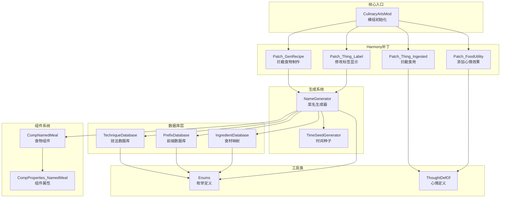
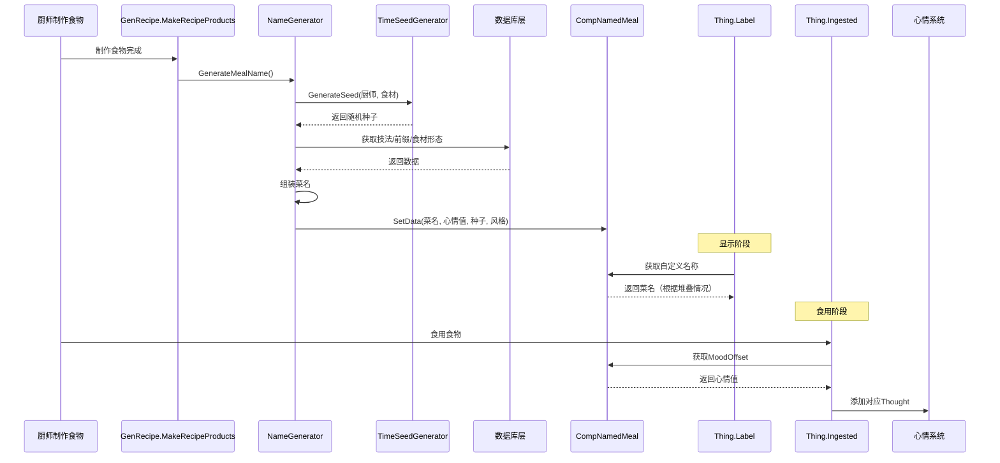

# 厨间百艺（Hundred Culinary Arts）模块总结

## 📋 项目概述

**厨间百艺**是一个 RimWorld 模组，为游戏中的食物系统添加动态菜名生成功能。该模组根据厨师技能、食材组合和时间因素，自动生成中西式风格的菜名，并提供相应的心情加成效果。

---

## 🏗️ 系统架构



---

## 📦 模块详细说明

### 1️⃣ 核心入口模块

#### [`CulinaryArtsMod.cs`](Source/CulinaryArts/CulinaryArtsMod.cs:10)
- **职责**: 模组主类，负责初始化
- **功能**:
  - 创建 Harmony 实例
  - 应用所有补丁
  - 输出初始化日志
- **关键代码**:
  ```csharp
  [StaticConstructorOnStartup]
  public static class CulinaryArtsMod
  ```

---

### 2️⃣ 组件系统

#### [`CompNamedMeal.cs`](Source/CulinaryArts/Components/CompNamedMeal.cs:8)
- **职责**: 为食物存储自定义数据
- **存储数据**:
  - `customName`: 自定义菜名
  - `moodOffset`: 心情加成值 (-3, 0, 3, 8)
  - `generationSeed`: 生成种子（用于调试）
  - `cuisineStyle`: 菜系风格（Chinese/Western）
- **关键方法**:
  - [`SetData()`](Source/CulinaryArts/Components/CompNamedMeal.cs:38): 设置所有数据
  - [`PostExposeData()`](Source/CulinaryArts/Components/CompNamedMeal.cs:49): 存档保存/加载
  - [`CompInspectStringExtra()`](Source/CulinaryArts/Components/CompNamedMeal.cs:61): 开发者模式调试信息

#### [`CompProperties_NamedMeal.cs`](Source/CulinaryArts/Components/CompProperties_NamedMeal.cs:8)
- **职责**: CompNamedMeal 的属性定义
- **功能**: 将组件类型绑定到 [`CompNamedMeal`](Source/CulinaryArts/Components/CompNamedMeal.cs:8)

---

### 3️⃣ 数据库层

#### [`TechniqueDatabase.cs`](Source/CulinaryArts/Data/TechniqueDatabase.cs:10)
- **职责**: 根据技能等级提供烹饪技法
- **技法分层**:
  - **Tier 1 (0-5级)**: 生存本能 - 煮、烤、乱炖等基础技法
  - **Tier 2 (6-12级)**: 烟火家常 - 爆炒、红烧、清蒸等家常技法
  - **Tier 3 (13-17级)**: 珍馐美馔 - 慢煨、白灼、糟卤等精致技法
  - **Tier 4 (18-20级)**: 登峰造极 - 乾坤、锦绣、佛跳墙等传说技法
- **关键方法**:
  - [`GetTechnique()`](Source/CulinaryArts/Data/TechniqueDatabase.cs:100): 根据技能等级获取技法
  - [`WeightedTierSelection()`](Source/CulinaryArts/Data/TechniqueDatabase.cs:125): 加权随机选择（高技能有机会使用更高级技法）
- **数据结构**:
  ```csharp
  Dictionary<TechniqueLevel, Dictionary<CuisineStyle, string[]>>
  ```

#### [`PrefixDatabase.cs`](Source/CulinaryArts/Data/PrefixDatabase.cs:10)
- **职责**: 提供品质前缀和心情效果
- **前缀品质**:
  - **Terrible (-3心情)**: 烧焦的、过咸的、没熟的等
  - **Good (+3心情)**: 美味的、主厨的、精心的等
  - **Legendary (+8心情)**: 绝世的、发光的、仙品等
- **技能概率分布**:
  - **0-5级**: 30%负面, 65%无, 5%正面
  - **6-12级**: 10%负面, 80%无, 10%正面
  - **13-17级**: 0%负面, 75%无, 20%正面, 5%传说
  - **18-20级**: 0%负面, 50%无, 30%正面, 20%传说
- **关键方法**:
  - [`GeneratePrefix()`](Source/CulinaryArts/Data/PrefixDatabase.cs:80): 根据技能等级生成前缀和心情值

#### [`IngredientDatabase.cs`](Source/CulinaryArts/Data/IngredientDatabase.cs:19)
- **职责**: 将食材 DefName 映射为烹饪形态
- **映射类型**:
  - 谷物类: Rice → 饭/粥/糕 (中式), Risotto/Paella (西式)
  - 肉类: Meat → 肉片/肉丝 (中式), Steak/Fillet (西式)
  - 蔬菜类: Potato → 土豆丝/土豆块 (中式), Fries/Mashed Potato (西式)
- **关键方法**:
  - [`GetForm()`](Source/CulinaryArts/Data/IngredientDatabase.cs:111): 获取食材烹饪形态
  - 支持精确匹配和模糊匹配（如 Meat_Muffalo → Meat）

---

### 4️⃣ 生成系统

#### [`NameGenerator.cs`](Source/CulinaryArts/Systems/NameGenerator.cs:13)
- **职责**: 核心菜名生成器，整合所有模块
- **生成流程**:
  1. 生成时间种子 → [`TimeSeedGenerator`](Source/CulinaryArts/Systems/TimeSeedGenerator.cs:11)
  2. 随机确定菜系风格（中式/西式）
  3. 获取厨师烹饪技能等级
  4. 生成前缀和心情效果 → [`PrefixDatabase`](Source/CulinaryArts/Data/PrefixDatabase.cs:10)
  5. 选择烹饪技法 → [`TechniqueDatabase`](Source/CulinaryArts/Data/TechniqueDatabase.cs:10)
  6. 转换食材为烹饪形态 → [`IngredientDatabase`](Source/CulinaryArts/Data/IngredientDatabase.cs:19)
  7. 组装完整菜名
  8. 保存到 [`CompNamedMeal`](Source/CulinaryArts/Components/CompNamedMeal.cs:8)
- **命名规则**:
  - **中式单食材**: `[前缀][技法][形态]` 例: 红烧肉排
  - **中式多食材**: `[前缀][技法][主料]配[辅料]` 例: 爆炒腰花配木耳
  - **西式单食材**: `[Prefix] [Technique] [Form]` 例: Glazed Salmon
  - **西式多食材**: `[Prefix] [Technique] [Main] with [Side]`
- **关键方法**:
  - [`GenerateMealName()`](Source/CulinaryArts/Systems/NameGenerator.cs:21): 主生成方法
  - [`GetDisplayLabel()`](Source/CulinaryArts/Systems/NameGenerator.cs:173): 智能显示逻辑（堆叠显示原名，单品显示自定义名）

#### [`TimeSeedGenerator.cs`](Source/CulinaryArts/Systems/TimeSeedGenerator.cs:11)
- **职责**: 生成确定性随机种子
- **设计目标**: 确保同厨师+同食材在6小时内产生相同菜名
- **种子组成**:
  ```
  seed = pawnHash ^ ingredientHash ^ timeWindow
  ```
  - `pawnHash`: 厨师 ID × 质数
  - `ingredientHash`: 食材哈希（按 DefName 排序后计算）
  - `timeWindow`: 游戏时间 ÷ 15000 ticks (6小时)
- **关键常量**: [`TICKS_PER_WINDOW = 15000`](Source/CulinaryArts/Utilities/Enums.cs:42) (6小时)

---

### 5️⃣ Harmony 补丁层

#### [`Patch_GenRecipe.cs`](Source/CulinaryArts/Harmony/Patch_GenRecipe.cs:12)
- **目标方法**: `GenRecipe.MakeRecipeProducts`
- **触发时机**: 食物制作完成时
- **职责**: 拦截食物生成，调用 [`NameGenerator.GenerateMealName()`](Source/CulinaryArts/Systems/NameGenerator.cs:21)
- **关键修复**: 将懒加载的 IEnumerable 转换为 List，避免迭代器陷阱

#### [`Patch_Thing_Label.cs`](Source/CulinaryArts/Harmony/Patch_Thing_Label.cs:11)
- **目标方法**: `Thing.Label` (Getter)
- **职责**: 修改食物标签显示
- **显示逻辑**:
  - 堆叠时显示原始名称
  - 单品/选中/携带时显示自定义名称

#### [`Patch_Thing_Ingested.cs`](Source/CulinaryArts/Harmony/Patch_Thing_Ingested.cs:11)
- **目标方法**: `Thing.Ingested`
- **触发时机**: 食物被食用完成时
- **职责**: 根据 [`CompNamedMeal.MoodOffset`](Source/CulinaryArts/Components/CompNamedMeal.cs:23) 添加心情效果

#### [`Patch_FoodUtility.cs`](Source/CulinaryArts/Harmony/Patch_FoodUtility.cs:11)
- **目标方法**: `FoodUtility.AddIngestThoughtsFromIngredient`
- **职责**: 补充心情效果添加（双重保险）
- **心情映射**:
  - -3 → [`CulinaryArts_Terrible`](Source/CulinaryArts/Utilities/ThoughtDefOf.cs:12)
  - +3 → [`CulinaryArts_Delicious`](Source/CulinaryArts/Utilities/ThoughtDefOf.cs:13)
  - +8 → [`CulinaryArts_Legendary`](Source/CulinaryArts/Utilities/ThoughtDefOf.cs:14)

---

### 6️⃣ 工具类

#### [`Enums.cs`](Source/CulinaryArts/Utilities/Enums.cs:1)
- **职责**: 定义枚举和常量
- **包含**:
  - [`CuisineStyle`](Source/CulinaryArts/Utilities/Enums.cs:6): 菜系风格（Chinese/Western）
  - [`TechniqueLevel`](Source/CulinaryArts/Utilities/Enums.cs:15): 技法等级（Survival/HomeCooking/Gourmet/Legendary）
  - [`PrefixQuality`](Source/CulinaryArts/Utilities/Enums.cs:26): 前缀品质（Terrible/-3, Good/+3, Legendary/+8）
  - [`Constants`](Source/CulinaryArts/Utilities/Enums.cs:37): 常量定义

#### [`ThoughtDefOf.cs`](Source/CulinaryArts/Utilities/ThoughtDefOf.cs:10)
- **职责**: ThoughtDef 引用工具类
- **定义**:
  - [`CulinaryArts_Terrible`](Source/CulinaryArts/Utilities/ThoughtDefOf.cs:12): -3 心情
  - [`CulinaryArts_Delicious`](Source/CulinaryArts/Utilities/ThoughtDefOf.cs:13): +3 心情
  - [`CulinaryArts_Legendary`](Source/CulinaryArts/Utilities/ThoughtDefOf.cs:14): +8 心情

---

## 🔄 数据流图



---

## 📊 模块依赖关系

### 核心依赖链
```
CulinaryArtsMod
    └── Harmony补丁层
            ├── Patch_GenRecipe → NameGenerator
            ├── Patch_Thing_Label → NameGenerator
            ├── Patch_Thing_Ingested → ThoughtDefOf
            └── Patch_FoodUtility → ThoughtDefOf

NameGenerator
    ├── TimeSeedGenerator
    ├── TechniqueDatabase → Enums
    ├── PrefixDatabase → Enums
    ├── IngredientDatabase → Enums
    └── CompNamedMeal → CompProperties_NamedMeal
```

### 模块间调用关系

| 调用者 | 被调用者 | 调用方法/属性 |
|--------|----------|---------------|
| [`Patch_GenRecipe`](Source/CulinaryArts/Harmony/Patch_GenRecipe.cs:12) | [`NameGenerator`](Source/CulinaryArts/Systems/NameGenerator.cs:13) | [`GenerateMealName()`](Source/CulinaryArts/Systems/NameGenerator.cs:21) |
| [`Patch_Thing_Label`](Source/CulinaryArts/Harmony/Patch_Thing_Label.cs:11) | [`NameGenerator`](Source/CulinaryArts/Systems/NameGenerator.cs:13) | [`GetDisplayLabel()`](Source/CulinaryArts/Systems/NameGenerator.cs:173) |
| [`NameGenerator`](Source/CulinaryArts/Systems/NameGenerator.cs:13) | [`TimeSeedGenerator`](Source/CulinaryArts/Systems/TimeSeedGenerator.cs:11) | [`GenerateSeed()`](Source/CulinaryArts/Systems/TimeSeedGenerator.cs:19) |
| [`NameGenerator`](Source/CulinaryArts/Systems/NameGenerator.cs:13) | [`PrefixDatabase`](Source/CulinaryArts/Data/PrefixDatabase.cs:10) | [`GeneratePrefix()`](Source/CulinaryArts/Data/PrefixDatabase.cs:80) |
| [`NameGenerator`](Source/CulinaryArts/Systems/NameGenerator.cs:13) | [`TechniqueDatabase`](Source/CulinaryArts/Data/TechniqueDatabase.cs:10) | [`GetTechnique()`](Source/CulinaryArts/Data/TechniqueDatabase.cs:100) |
| [`NameGenerator`](Source/CulinaryArts/Systems/NameGenerator.cs:13) | [`IngredientDatabase`](Source/CulinaryArts/Data/IngredientDatabase.cs:19) | [`GetForm()`](Source/CulinaryArts/Data/IngredientDatabase.cs:111) |
| [`NameGenerator`](Source/CulinaryArts/Systems/NameGenerator.cs:13) | [`CompNamedMeal`](Source/CulinaryArts/Components/CompNamedMeal.cs:8) | [`SetData()`](Source/CulinaryArts/Components/CompNamedMeal.cs:38) |
| [`Patch_Thing_Ingested`](Source/CulinaryArts/Harmony/Patch_Thing_Ingested.cs:11) | [`ThoughtDefOf`](Source/CulinaryArts/Utilities/ThoughtDefOf.cs:10) | 静态字段 |
| [`Patch_FoodUtility`](Source/CulinaryArts/Harmony/Patch_FoodUtility.cs:11) | [`ThoughtDefOf`](Source/CulinaryArts/Utilities/ThoughtDefOf.cs:10) | 静态字段 |

---

## 🎯 关键设计特性

### 1. 确定性随机
- 使用 [`TimeSeedGenerator`](Source/CulinaryArts/Systems/TimeSeedGenerator.cs:11) 确保同厨师+同食材在6小时内生成相同菜名
- 种子组合: `pawnHash ^ ingredientHash ^ timeWindow`

### 2. 技能导向的品质系统
- 技能越高，负面前缀概率越低
- 高技能有机会使用更高级技法（加权随机）
- 18-20级厨师有20%概率触发传说级菜品

### 3. 双语言支持
- 所有数据库都包含中文和英文版本
- 菜名生成时随机选择菜系风格

### 4. 智能显示逻辑
- 堆叠时显示原始名称（避免UI混乱）
- 单品/选中/携带时显示自定义名称

### 5. 数据持久化
- [`CompNamedMeal.PostExposeData()`](Source/CulinaryArts/Components/CompNamedMeal.cs:49) 确保菜名在存档后保持一致

---

## 📈 统计数据

| 类别 | 数量 | 备注 |
|------|------|------|
| **总源文件** | 13 个 | 不含配置和定义文件 |
| **组件类** | 2 个 | CompNamedMeal, CompProperties_NamedMeal |
| **数据库类** | 3 个 | Technique, Prefix, Ingredient |
| **系统类** | 2 个 | NameGenerator, TimeSeedGenerator |
| **Harmony补丁** | 4 个 | GenRecipe, Label, Ingested, FoodUtility |
| **工具类** | 2 个 | Enums, ThoughtDefOf |
| **技法总数** | 约150+ | 跨4个等级，中西两种风格 |
| **前缀总数** | 48 个 | 3个品质等级，中西两种风格 |
| **食材映射** | 10+ 种 | 可扩展 |

---

## 🔍 代码质量特点

### ✅ 优点
1. **模块化设计**: 职责分离清晰，数据库/生成器/补丁各司其职
2. **异常处理**: 所有补丁都有 try-catch 保护
3. **可扩展性**: 数据库结构支持轻松添加新技法/前缀/食材
4. **调试友好**: 开发者模式下提供详细日志
5. **存档兼容**: 使用 [`PostExposeData()`](Source/CulinaryArts/Components/CompNamedMeal.cs:49) 正确保存数据

### 🔧 可改进点
1. **配置化**: 技法/前缀数据库可考虑从 XML 加载
2. **本地化**: 语言切换可基于游戏设置而非随机
3. **性能优化**: 可缓存常用的食材映射结果

---

## 📝 总结

**厨间百艺**是一个精心设计的模组，通过多层次的数据库系统和智能生成算法，为 RimWorld 的食物系统注入了深度和趣味性。其核心优势在于：

- ✨ **沉浸感强**: 动态生成的菜名增加游戏真实感
- 🎲 **可控随机**: 平衡了随机性和确定性
- 🎯 **技能关联**: 厨师技能直接影响菜品质量
- 🌏 **文化融合**: 中西菜系各具特色

该模组展示了如何通过Harmony补丁无缝扩展游戏核心机制，是RimWorld模组开发的优秀范例。