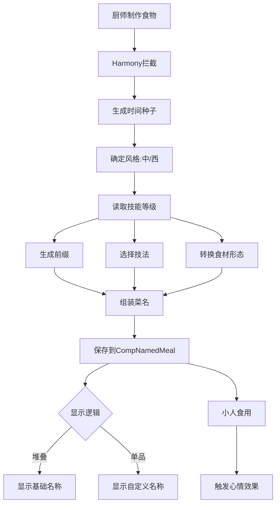

# 厨间百艺 (Culinary Arts 100) - 项目规划总结

## 项目概述

**项目名称**: 厨间百艺 (Culinary Arts 100)  
**类型**: RimWorld 模组  
**核心功能**: 程序化动态菜名生成系统  
**技术栈**: C# + Harmony + XML

---

## 核心设计理念

### 三大支柱

1. **沉浸感 (Immersion)**
   - 每道菜都有独特的名字
   - 名称反映厨师技艺和食材组合
   - 避免千篇一律的"精致食物"

2. **动态性 (Dynamic)**
   - 同样材料，新手做是"糊"，大师做是"宴"
   - 技能等级直接影响菜品质量和名称
   - 时间种子确保短期内一致性

3. **隐形增强 (Subtle Buff)**
   - 不破坏原版平衡
   - 通过低概率"绝世"词条提供额外价值
   - 心情效果范围: -3 到 +8

---

## 系统架构图



---

## 核心算法

### 时间种子公式

```
Seed = (PawnID × 397) ⊕ (IngredientsHash) ⊕ (GameTicks ÷ 15000)
```

**特性**:
- 同厨师 + 同食材 + 6小时内 = 相同菜名
- 跨时间窗口自动变化
- 确定性随机，可复现

### 菜名生成流程

```
1. 风格判定 → 中式 or 西式
2. 技能分级 → Tier 1-4
3. 前缀概率 → 负面/无/正面/传说
4. 技法选择 → 从对应Tier词库抽取
5. 形态映射 → 食材DefName → 现实形态
6. 名称组装 → 按风格模板拼接
```

---

## 技能等级与产出对照表

| 等级 | Tier | 负面 | 无前缀 | 正面 | 传说 | 示例菜名 |
|------|------|------|--------|------|------|---------|
| 0-5 | 生存本能 | 30% | 65% | 5% | 0% | 没熟的乱炖肉块 |
| 6-12 | 烟火家常 | 10% | 80% | 10% | 0% | 红烧肉排配土豆丝 |
| 13-17 | 珍馐美馔 | 0% | 75% | 20% | 5% | 主厨的慢煨狮子头 |
| 18-20 | 登峰造极 | 0% | 50% | 30% | 20% | 绝世的佛跳墙海鲜饭 |

---

## 数据内容统计

### 词库规模

| 类别 | 中式 | 西式 | 总计 |
|------|------|------|------|
| **技法词汇** |
| Tier 1 (0-5级) | 8个 | 8个 | 16个 |
| Tier 2 (6-12级) | 15个 | 15个 | 30个 |
| Tier 3 (13-17级) | 25个 | 25个 | 50个 |
| Tier 4 (18-20级) | 10个 | 10个 | 20个 |
| **前缀词汇** |
| 负面 | 8个 | 8个 | 16个 |
| 正面 | 8个 | 8个 | 16个 |
| 传说 | 8个 | 8个 | 16个 |
| **食材映射** |
| 谷物类 | 3种 | 3种 | 6种 |
| 肉类 | 4种 | 4种 | 8种 |
| 蔬菜类 | 3种 | 3种 | 6种 |
| 特殊类 | 3种 | 3种 | 6种 |

**组合可能性**: 
- 技法 × 食材形态 × 前缀 = 数千种独特菜名
- 实际游戏中接近无限变化

---

## 开发阶段规划

### Phase 1: 基础框架 (预计2周)
- [x] 架构设计完成
- [ ] 创建项目结构
- [ ] 配置About.xml和.csproj
- [ ] 实现CompNamedMeal组件
- [ ] 实现时间种子系统

**交付物**: 可编译的mod骨架

### Phase 2: 核心系统 (预计3周)
- [ ] 实现食材形态映射
- [ ] 实现技能分级词库
- [ ] 实现前缀生成系统
- [ ] 实现菜名组装算法
- [ ] 基础Harmony补丁

**交付物**: 能生成菜名的最小可用版本

### Phase 3: 游戏集成 (预计2周)
- [ ] Label显示补丁
- [ ] 心情系统集成
- [ ] ThoughtDef定义
- [ ] 堆叠逻辑优化

**交付物**: 完整功能的beta版

### Phase 4: 内容扩充 (预计3周)
- [ ] 完善所有食材映射
- [ ] 补充完整词库
- [ ] 中英文本地化
- [ ] 平衡性调整

**交付物**: 内容完整的rc版

### Phase 5: 测试发布 (预计2周)
- [ ] 单元测试
- [ ] 游戏内测试
- [ ] 性能优化
- [ ] 文档编写
- [ ] Steam Workshop发布

**交付物**: v1.0正式版

**总计**: 约12周 (3个月)

---

## 技术挑战与解决方案

### 挑战1: 性能问题
**问题**: 频繁字符串操作可能影响性能  
**解决方案**: 
- 缓存生成的名称
- 使用StringBuilder
- 延迟计算策略

### 挑战2: 存档兼容性
**问题**: 自定义数据需要保存  
**解决方案**: 
- 使用Scribe系统正确序列化
- 向后兼容检查
- 可选的种子重生成

### 挑战3: Mod兼容性
**问题**: 其他烹饪mod可能冲突  
**解决方案**: 
- 使用后置Harmony补丁
- 检测并适配常见mod
- 提供兼容性开关

### 挑战4: 本地化维护
**问题**: 双语词库维护复杂  
**解决方案**: 
- 独立数据文件
- 社区翻译接口
- 自动化验证脚本

---

## 文件结构总览

```
Hundred Culinary Arts/
├── 📄 About/
│   ├── About.xml              [Mod元数据]
│   └── Preview.png            [Steam封面]
│
├── 📦 Assemblies/
│   └── CulinaryArts.dll       [编译输出]
│
├── 📝 Defs/
│   └── ThoughtDefs/
│       └── Thoughts_Memory_CulinaryArts.xml
│
├── 🌐 Languages/
│   ├── English/Keyed/
│   └── ChineseSimplified/Keyed/
│
├── 💻 Source/CulinaryArts/
│   ├── Components/
│   │   ├── CompNamedMeal.cs
│   │   └── CompProperties_NamedMeal.cs
│   ├── Systems/
│   │   ├── TimeSeedGenerator.cs
│   │   └── NameGenerator.cs
│   ├── Data/
│   │   ├── IngredientDatabase.cs
│   │   ├── TechniqueDatabase.cs
│   │   └── PrefixDatabase.cs
│   ├── Harmony/
│   │   ├── Patch_GenRecipe.cs
│   │   ├── Patch_Thing_Label.cs
│   │   └── Patch_FoodUtility.cs
│   └── Utilities/
│       ├── Enums.cs
│       └── ThoughtDefOf.cs
│
├── 🔨 Build.ps1               [自动化构建脚本]
├── 📖 ARCHITECTURE.md         [技术架构文档]
├── 📊 DATABASE_DESIGN.md      [数据词库设计]
├── 🛠️ IMPLEMENTATION_GUIDE.md [实施指南]
└── 📋 PROJECT_PLAN.md         [项目规划(本文件)]
```

---

## 质量保证计划

### 代码质量
- ✅ 遵循C#编码规范
- ✅ 使用命名空间隔离
- ✅ 充分的注释和文档
- ✅ 错误处理和日志记录

### 测试覆盖
- 单元测试: 种子生成、名称组装
- 集成测试: Harmony补丁、存档加载
- 游戏测试: 不同技能等级、多种食材
- 压力测试: 大量食物生成、长期运行

### 用户体验
- 直观的菜名显示
- 流畅的游戏性能
- 清晰的Mod说明
- 活跃的社区支持

---

## 版本路线图

### v0.1-alpha (第4周)
- 核心框架
- 基础命名系统
- 内部测试版

### v0.5-beta (第8周)
- 完整词库
- 心情系统
- 公开测试版

### v1.0-release (第12周)
- 完整本地化
- 性能优化
- Steam Workshop发布

### v1.1+ (后续迭代)
- 社区反馈优化
- 新增食材支持
- Mod兼容性扩展
- 可能的DLC内容支持

---

## 成功指标

### 技术指标
- [ ] 编译无错误无警告
- [ ] 所有Harmony补丁正常工作
- [ ] 存档加载无数据丢失
- [ ] 性能影响 < 5%

### 内容指标
- [ ] 支持30+种食材
- [ ] 提供100+种技法
- [ ] 实现4个技能Tier
- [ ] 中英文完整翻译

### 用户指标
- [ ] Steam Workshop评分 > 4.5星
- [ ] 订阅数 > 1000
- [ ] 无严重bug报告
- [ ] 积极的社区反馈

---

## 依赖关系

### 必需依赖
- **RimWorld 1.4+**: 游戏本体
- **Harmony**: Mod框架 (自动加载)
- **.NET Framework 4.7.2**: 运行时

### 可选兼容
- Vanilla Cooking Expanded
- Gastronomy
- 其他烹饪/食物Mod

### 开发工具
- Visual Studio 2022 / VS Code
- Git版本控制
- PowerShell (构建脚本)

---

## 风险评估

### 高风险
❌ **Harmony补丁失效**: RimWorld更新可能破坏补丁  
**缓解措施**: 跟进游戏更新，保持mod维护

### 中风险
⚠️ **性能问题**: 大量食物可能影响帧率  
**缓解措施**: 优化算法，缓存机制

⚠️ **Mod冲突**: 其他mod修改同样的方法  
**缓解措施**: 使用Transpiler，提供兼容选项

### 低风险
✅ **翻译质量**: 词库翻译不够准确  
**缓解措施**: 社区贡献，迭代改进

---

## 参考文档

- 📘 [ARCHITECTURE.md](ARCHITECTURE.md) - 详细技术架构
- 📊 [DATABASE_DESIGN.md](DATABASE_DESIGN.md) - 完整数据词库
- 🛠️ [IMPLEMENTATION_GUIDE.md](IMPLEMENTATION_GUIDE.md) - 分步实施指南

---

## 下一步行动

### 立即可做
1. ✅ 审查架构设计
2. ✅ 确认开发计划
3. 🔄 切换到Code模式开始实施
4. 📝 创建Git仓库

### 第一周目标
- 创建完整项目结构
- 编写CompNamedMeal组件
- 实现时间种子系统
- 通过编译测试

---

**文档版本**: 1.0  
**创建日期**: 2025-12-26  
**架构师**: Roo  
**状态**: ✅ 规划完成，等待实施批准