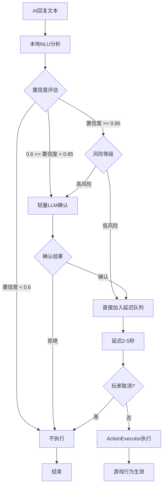

# RimTalk 行为触发系统重新设计方案 v2.0

## 1. 问题诊断

### 1.1 当前失败原因分析

**根本问题**：LLM在深度角色扮演时，会优先保持角色一致性，不愿意"打破第四面墙"输出格式化指令。

| 方法 | 结果 | 原因分析 |
|------|------|----------|
| JSON指令注入 | ❌ 失败 | AI认为角色不会说JSON |
| `[[ACTION: XXX]]` 标签 | ❌ 失败 | 同上，标签语法不属于角色语言 |
| "复述指令"方式 | ✅ 成功 | AI可以在角色内"复述"，因为角色说"好的，我复述..." |

**关键洞察**：
- AI不拒绝规则本身（理解规则）
- AI拒绝的是"以OOC方式输出"
- AI接受"角色内复述"（因为这是角色在说话）

### 1.2 约束条件

- **LLM**：DeepSeek / Gemini Flash
- **成本**：最多接受10%额外开销
- **延迟**：可接受，甚至需要（符合自然行为）
- **Function Calling**：不依赖（通用方案）

---

## 2. 新方案设计：本地NLU + 可选轻量确认

### 2.1 核心理念

**放弃让LLM输出指令，改为本地分析LLM的自然语言回复**

```
┌────────────────────────────────────────────────────────────────┐
│                      新架构流程                                  │
├────────────────────────────────────────────────────────────────┤
│                                                                │
│  玩家输入 ──────┬────────────────────────────────────────────► │
│                │                                              │
│                ▼                                              │
│  ┌──────────────────────┐                                     │
│  │     RimTalk LLM      │  (正常角色扮演对话)                   │
│  │   角色扮演 + 回复     │                                     │
│  └──────────┬───────────┘                                     │
│             │                                                  │
│             ▼                                                  │
│  ┌──────────────────────┐     ┌─────────────────────┐         │
│  │   本地 NLU 分析器     │────►│   置信度评分        │         │
│  │  关键词/情感/语法     │     │   0.0 - 1.0        │         │
│  └──────────┬───────────┘     └──────────┬──────────┘         │
│             │                            │                    │
│             ▼                            ▼                    │
│    ┌────────────────────────────────────────────────┐         │
│    │              决策矩阵                           │         │
│    ├────────────────────────────────────────────────┤         │
│    │  置信度 > 0.85 + 低风险行为  → 直接执行         │         │
│    │  置信度 > 0.85 + 高风险行为  → 轻量LLM确认      │         │
│    │  置信度 0.6-0.85            → 轻量LLM确认       │         │
│    │  置信度 < 0.6               → 不执行            │         │
│    └────────────────────────────────────────────────┘         │
│                        │                                       │
│                        ▼                                       │
│             ┌──────────────────────┐                          │
│             │   延迟执行队列       │                           │
│             │   2-5秒自然延迟      │                           │
│             └──────────────────────┘                          │
│                                                                │
└────────────────────────────────────────────────────────────────┘
```

### 2.2 本地NLU分析器设计

#### 2.2.1 多层分析架构

```
Layer 1: 关键词匹配 (快速筛选)
    ↓
Layer 2: 否定词检测 (排除误判)
    ↓
Layer 3: 语义模式匹配 (上下文理解)
    ↓
Layer 4: 情感极性分析 (积极/消极)
    ↓
Output: 意图 + 置信度 + 情感
```

#### 2.2.2 意图识别规则示例

**招募意图识别**：

```csharp
public class RecruitIntentRule : IIntentRule
{
    // 强肯定关键词 (权重 +0.4)
    private static readonly string[] StrongPositive = {
        "愿意加入", "我加入", "算我一个", "带我走", 
        "跟你走", "效忠于你", "我是你的人", "一起干"
    };
    
    // 弱肯定关键词 (权重 +0.2)
    private static readonly string[] WeakPositive = {
        "好吧", "可以考虑", "那就这样", "行吧",
        "同意", "好的", "没问题"
    };
    
    // 否定关键词 (权重 -0.5)
    private static readonly string[] Negative = {
        "不会加入", "拒绝", "别想", "休想", 
        "不可能", "我不愿意", "绝不", "算了"
    };
    
    // 语义模式 (正则 + 权重)
    private static readonly PatternRule[] Patterns = {
        new ("我.*?(?:决定|选择|愿意).*?(?:加入|跟随)", +0.5f),
        new ("(?:好|行|可以).*?(?:我加入|跟你走)", +0.4f),
        new ("(?:从今|从此|现在).*?(?:跟着你|听你的)", +0.4f),
        new ("(?:不|没|别).*?(?:加入|跟你|听你)", -0.6f),
    };
    
    // 上下文增强
    // 如果对话历史中玩家明确提出招募请求，增加基础置信度
    private float ContextBoost(ConversationContext ctx) {
        if (ctx.PlayerAskedToRecruit) return +0.2f;
        return 0f;
    }
}
```

**恋爱意图识别**：

```csharp
public class RomanceIntentRule : IIntentRule
{
    private static readonly string[] StrongPositive = {
        "我也喜欢你", "我爱你", "做我的人", 
        "在一起吧", "我愿意", "嫁给你", "娶你"
    };
    
    private static readonly string[] WeakPositive = {
        "心动", "喜欢", "动心", "好感", 
        "不讨厌", "有点感觉"
    };
    
    private static readonly string[] Negative = {
        "只当朋友", "不合适", "对不起", 
        "不喜欢", "别这样", "我们不可能"
    };
}
```

#### 2.2.3 风险等级分类

| 风险等级 | 行为类型 | 说明 |
|---------|---------|------|
| 低风险 | 社交聚餐、休闲放松 | 可逆，无持久影响 |
| 中风险 | 赠送物品、休息 | 有轻微游戏影响 |
| 高风险 | 招募、恋爱关系 | 持久影响，需确认 |
| 极高风险 | 分手、投降 | 重大负面后果 |

### 2.3 轻量LLM确认机制

#### 2.3.1 触发条件

仅在以下情况调用确认LLM：
1. 本地NLU置信度在 0.6-0.85 之间（不确定区）
2. 高风险行为且置信度 > 0.85

#### 2.3.2 超短Prompt设计（约50 tokens）

```
Classify: "同意加入" or "拒绝加入"?

Dialog:
Player: 跟我们一起干吧
NPC: {AI的回复内容}

Answer (one word only):
```

**预期输出**：`同意` 或 `拒绝`

#### 2.3.3 成本估算

假设：
- 平均每10次对话触发1次确认
- 确认调用约100 tokens（输入50+输出10+buffer）
- 主对话平均1000 tokens

成本增加 = 100 / (10 × 1000) = 1% 

**远低于10%预算，有余量**

### 2.4 延迟执行系统

#### 2.4.1 设计目标

1. 符合自然人类行为节奏
2. 给玩家反应/取消的机会
3. 增加游戏沉浸感

#### 2.4.2 延迟规则

| 行为类型 | 延迟时间 | 说明 |
|---------|---------|------|
| 情感反应 | 0.5-1秒 | 点头、微笑等 |
| 简单行为 | 1-2秒 | 休息、放松 |
| 重要决定 | 2-4秒 | 招募、恋爱 |
| 物理行为 | 3-5秒 | 赠送物品、聚餐 |

#### 2.4.3 可取消机制

```csharp
public class PendingAction
{
    public string ActionType;
    public Pawn Actor;
    public Pawn Target;
    public float Delay;
    public float TimeRemaining;
    public bool IsCancellable = true;
    
    // 玩家点击角色时显示待执行行为
    // 提供"取消"按钮
}
```

---

## 3. 与现有代码的集成

### 3.1 保留的组件

| 组件 | 保留/替换 | 说明 |
|------|----------|------|
| `ActionExecutor.cs` | ✅ 保留 | 行为执行逻辑不变 |
| `RimTalkActions.cs` | ✅ 保留 | 具体游戏效果不变 |
| `BehaviorRuleContents.cs` | ⚠️ 简化 | 只保留常识，移除输出格式要求 |
| `AIResponsePostProcessor.cs` | ❌ 替换 | 改用新NLU分析器 |
| `LLMTagParser.cs` | ❌ 废弃 | 不再需要标签解析 |
| `HybridIntentRecognizer.cs` | 🔄 重写 | 新的混合分析逻辑 |

### 3.2 新增组件

```
Source/Memory/AI/
├── LocalNLUAnalyzer.cs         # 本地NLU分析器
├── IntentRules/                # 意图识别规则
│   ├── IIntentRule.cs          # 规则接口
│   ├── RecruitIntentRule.cs    # 招募意图
│   ├── RomanceIntentRule.cs    # 恋爱意图
│   ├── SurrenderIntentRule.cs  # 投降意图
│   ├── GiftIntentRule.cs       # 赠送意图
│   └── SocialIntentRule.cs     # 社交意图
├── LightweightConfirmer.cs     # 轻量LLM确认器
├── DelayedActionQueue.cs       # 延迟执行队列
└── IntentDecisionMatrix.cs     # 决策矩阵
```

### 3.3 Hook点改造

**之前**：Hook AI回复添加 → 解析标签 → 执行

**现在**：Hook AI回复添加 → 本地NLU分析 → [可选确认] → 延迟执行

---

## 4. 规则内容改造

### 4.1 移除的内容

不再需要要求AI输出格式化指令：

```diff
- 【强制规则】当谈话涉及【招募、加入】话题，且NPC同意时，
- 你必须在回复末尾附加JSON：{"action": "recruit"}
```

### 4.2 保留的常识（简化版）

```csharp
public const string RECRUIT_COMMON_SENSE = @"
关于加入派系：
- 当角色对邀请感到满意时，会用积极的方式表达同意
- 表达方式可能包括：直接说愿意、表示认同、承诺跟随等
- 角色可能会犹豫、提条件、或直接拒绝
- 请根据角色性格和当前情境做出自然反应
";
```

**目的**：引导AI产生可分析的自然语言，而非强制输出格式

---

## 5. 实现优先级

### Phase 1: 核心框架（优先）
1. `LocalNLUAnalyzer` - 本地分析器骨架
2. `RecruitIntentRule` - 招募规则（最常用）
3. `IntentDecisionMatrix` - 决策逻辑
4. 集成到现有Hook

### Phase 2: 完善规则
5. 其他意图规则（恋爱、投降等）
6. 规则调优和阈值调整
7. 测试和迭代

### Phase 3: 增强功能
8. `LightweightConfirmer` - 轻量确认
9. `DelayedActionQueue` - 延迟队列
10. 取消机制UI

---

## 6. 风险与缓解

| 风险 | 概率 | 影响 | 缓解措施 |
|------|------|------|----------|
| NLU误判导致误触 | 中 | 高 | 高风险行为强制确认 |
| NLU漏判导致无响应 | 中 | 低 | 可接受，比误触好 |
| 规则维护复杂 | 低 | 中 | 模块化设计，易于扩展 |
| 用户体验不自然 | 低 | 中 | 延迟机制增加自然感 |

---

## 7. 成功指标

| 指标 | 目标 | 说明 |
|------|------|------|
| 正确触发率 | > 80% | 应触发时正确触发 |
| 误触发率 | < 5% | 不应触发时错误触发 |
| 额外成本 | < 10% | 符合预算 |
| 延迟感知 | 自然 | 用户反馈 |

---

## 8. 流程图



---

## 9. 下一步

确认此方案后，将切换到Code模式实现：

1. 创建 `LocalNLUAnalyzer.cs`
2. 实现意图规则接口和招募规则
3. 修改现有Hook逻辑
4. 测试和迭代
